# Main screen

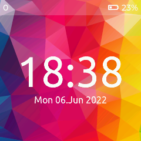

On startup you see the main screen (time tile). It shows the time and widgets.

Widgets are:

* the current weather (if correctly configured).
* the next alarm.
* the notifications.

# Screen Navigation

 You can swipe with you fingers up, down, left and right between the four main screens. The four screens are organized in time, apps, note and setup tile.

# Notes

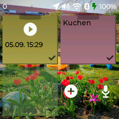

The note tile holds a few post-it notes, as many as fit on the screen at once. There is no list and
no archive: what you see is all there is. The plus button adds a text note and opens the keyboard,
tapping a note edits it again, and the check mark in its corner ticks it off. A note that is ticked
off fades out and is deleted a minute later, so tapping the check again undoes it. When every slot
is taken, the plus buttons grey out until you tick a note off.

On watches with a microphone the recorder adds a second plus button. It takes you straight to the
recording screen, and the finished take comes back as a voice note with a play button. The note
only references the recording — checking it off removes the note, the file stays in the voice
recorder app.

# Quick Settings

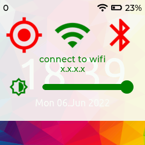

A subset of settings can be accessed via a swipe from the top of the screen.

# Settings

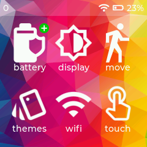
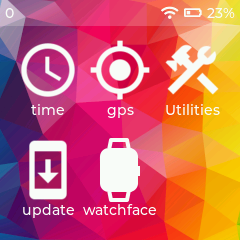

Once a setting is selected, you can leave the form with the exit button.

## Battery

Battery status.

## Display

Set color, background, touch feedback with vibrations...

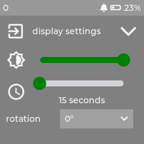
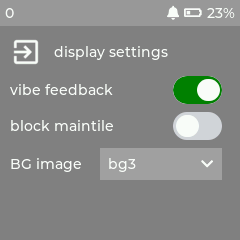

## Touch

Touch calibration menu.

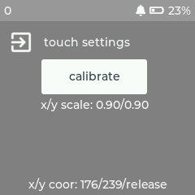
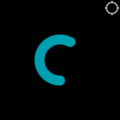

## Move

Enable:

* step counter
* double click
* tilt
* display of step counter

The stepcounter value is published to [gadgetbridge](https://gadgetbridge.org) automatically if bluetooth is enabled.
The frequency of publication is driven by gadgetbridge.
Initially, it is on a 30 minutes frequency.
When the realtime tab of gadgetbridge is selected, the frequency is set to every 5 seconds.
If the watch lost contact with gadgetbridge for more than 30 minutes, the stepcounter is also refreshed when bluetooth is reconnected.


## Bluetooth

The bluetooth notification work with [gadgetbridge](https://gadgetbridge.org) very well. But keep in mind, bluetooth in standby reduces the battery runtime.


## WiFi

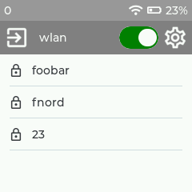

## Time

* Enable synchronisation when connect
* Display 12/24 hours
* Select region and location

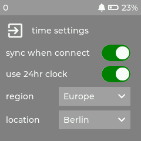

## Updates

It is possible to update over the air.


## Utilities

* Format
* Reboot
* Poweroff
* GPS injection


## Sound 

* Enable sound
* Set volume


## GPS


## Watchfaces

If you want to customize your own watchface, copy a  to your watch and decompress it with the watchface app.

A `watchface.tar.gz` includes the following files and a extra `watchface_theme.json`. Some example:


In the file `watchface_theme.json` you will describe the position of information via the `label` or 'image' node. See Cf. [here](WATCHFACE.md) for a node list.
Here you can find some finish watchface packages:

[](images/watchface/swiss/watchface.tar.gz)
[](images/watchface/undone/watchface.tar.gz)
[](images/watchface/startrek/watchface.tar.gz)
[](images/watchface/rainbow/watchface.tar.gz)
[](images/watchface/hal9000/watchface.tar.gz)
[](images/watchface/black/watchface.tar.gz)

alternative [watchfaces](https://github.com/PGNetHun/PG-TTGO-Watchfaces)

# Applications

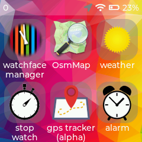

## weather app

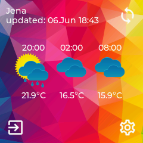

For the weather app you need an openweather.com api-id. http://openweathermap.org/appid is a good starting point.

## Stopwatch

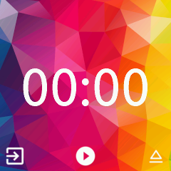

Click play to start.

## Alarm

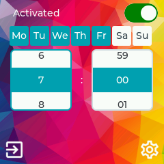

You can set an alarm, by setting time and day(s) of the week.

The main switch controls if alarm is enabled or not.

Next, select the day(s) of the week for the alarm.
Note that if no days are select, it means an every day alarm.
Finally, select the hour and minute for the alarm.

In the settings, you can select the reminder: vibe, fade, beep.
You can also have the next alarm displayed on the main face.

## ir-remote

For customise your ir-codes, use [WConfigurator](https://github.com/anakod/WConfigurator). For an example ir-remote.json configuration file see [here](https://github.com/d03n3rfr1tz3/TTGO.T-Watch.2020/blob/master/conf/ir-remote.json.example).

```json
{
    "pages": [{
            "Power": {
                "m": 7,
                "hex": "E0E040BF"
            },
            .
            .
            .
            "Stop": {
                "m": 7,
                "hex": "E0E0629D"
            }
        }
    ],
    "defBtnHeight": 33,
    "defBtnWidth": 65,
    "defSpacing": 2
}
```

IR-modes supported:

RC5 = 1, 
RC6 = 2,
NEC = 3,
SONY = 4,
PANASONIC = 5,
JVC = 6,
SAMSUNG = 7,
LG = 10,
SHARP = 14,
RAW = 30,
SAMSUNG36 = 56

IR-data format supported:

raw,
hex

## watchface

This application let you download community based watch faces.
Browse watch face with left/right button.
Clic on the icon when you find yours.

Here you can find an overview of all [watchfaces](https://sharandac.github.io/My-TTGO-Watchfaces/) on github.

Note that the information are downloaded in real time (remember to activate WiFi):

* The list of watchfaces.
* The preview of each watch.

## OSMmap


A long press in the middle centers the map to the current gps position.

## OSMAnd


In connection with [OsmAnd](https://osmand.net) the watch can also be used for navigation. Please use the osmand app, otherwise a lot of messages will be displayed.

## gps tracker

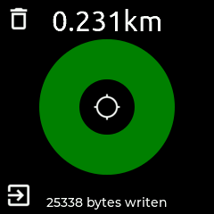
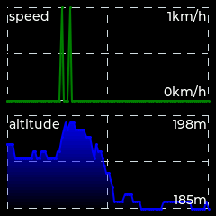

gps tracker that generates .gpx files. Only works properly with watches that have GPS. A long press on the crosshairs starts and stops the logging. The .gpx files can be downloaded via FTP and imported directly into e.g. GoogleMaps or OSM. The trash icon deletes all files to save space.

## gps status

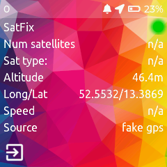

## astro

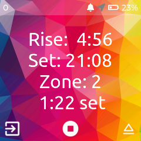

## powermeter

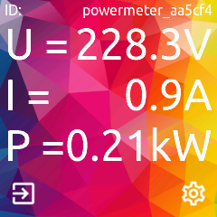

Get realtime data from a [powermeter](https://github.com/sharandac/powermeter) over mqtt.

## wfif mon

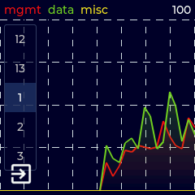

## Activity tracker

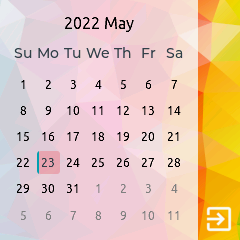

The activity tracker let you check your activity.

In the settings, set your step length and your goals in step and meters.

When associated to Gadgetbrige, activity is reported regularly.
If you need to ensure a synchronization, for example at the beginning of an activity or at the end, you can use the refresh button.
It will force a synchronization.

The trash can button allows to reset step counter.
Useful when starting a new activity an keeping exact track of it.

## Sailing

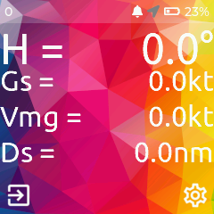

This app connects to your [OpenPlotter](https://openmarine.net/openplotter) and shows some of your boat stats.

In order to make it work you have to configure your OpenCPN plotter in the connections tab as follows:


Set "Output filtering" to trasmit the sentences: RMB,RMC,APB

Contact [fliuzzi02](https://github.com/fliuzzi02) for further info and help.
Some improvements might come in the future.

## Assist

The voice assistant of Home Assistant on your wrist. Tap the button, ask your question and the watch
shows what it understood and what Home Assistant answered. With `speak answer` turned on, the answer
is spoken as well, using the voice of your pipeline.

Pairing works with a QR code, so no long token has to be typed on the watch. The pairing tile shows
the code, your phone confirms it in Home Assistant and the watch issues its own token afterwards.
Only the pipeline is left to choose, if you have more than one.

Needs a microphone, so this app is only built for the T-Watch 2020 V3.

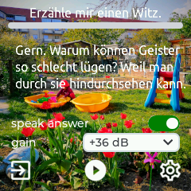

## Calc

A simple calculator.
Beware that the button C/CE has two functions. A short touch uses CE, which clears only the
recent input. A longer touch uses C, which clears all inputs and basically resets the calculator.

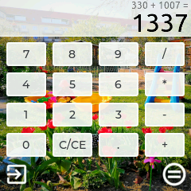

## Kodi Remote

A remote for controlling Kodi. Includes a player tile and a tile for a remote control.


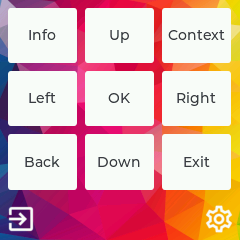

## MQTT Player

A simple MQTT player. I personally used it to control the Phoniebox of our little one, if needed.
Phoniebox brings a small extension to expose attributes and commands into MQTT. But I implemented it
configurable, so that it can be used with other players exposed through MQTT.

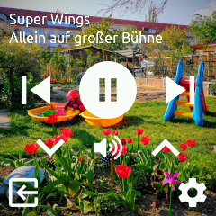

## MQTT Control

A configurable MQTT Control board. You can add labels that show formatted values, buttons that just
publish something or switches that basically subscribe to and publish an on/off state. In my case,
I can switch on/off my printer, see some battery values of different devices and make a random noise
on a buzzer in a specific project.

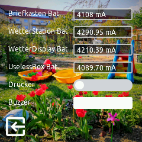

## NetTools

Wake-on-LAN for the machines at home. Every configured target gets its own button and a tap sends the
magic packet, to the broadcast address of the current network as well, because some access points drop
the limited broadcast.

Since nobody knows the MAC address of his devices by heart, there is a small sniffer next to it. It
listens for wake, DHCP and NetBIOS packets and offers what it has seen, so you can just power on a
device once and pick it from the list.

## Ping

Ping, traceroute and a simple port check, for the moment when the WiFi feels broken and the computer is
two rooms away. Enter a host name or an IP, pick the tool and read the result on the watch.

## Pong

Based on some groundwork of [bwagstaff](https://github.com/bwagstaff), that can be found here: https://github.com/bwagstaff/My-TTGO-Watch/tree/master/src/app/games

A simple Pong game using the Accelerometer of the T-Watch 2020. It also has some nostalgic sound.

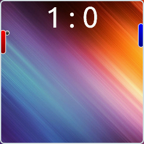

## Printer 3D

An app to view the state and progress of my 3D Printer. Uses G-Codes over WiFi to communicate.

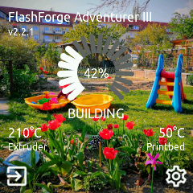

## Sound Analyzer

A small measurement kit for the microphone. It has a waterfall over time, a third octave spectrum, an
oscilloscope and a tone generator with the 20 third octave center frequencies from 100 Hz to 8 kHz. The
header always shows the loudest frequency and the level in dB SPL.

I use it to find out which of my devices is humming, and the tone generator to check if a speaker still
does what it should.

Needs a microphone, so this app is only built for the T-Watch 2020 V3.

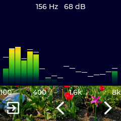
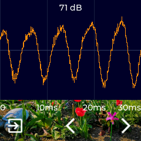

## Sound Meter

A sound level meter and nothing else. It shows the current level in dB SPL, a bar for the eye and the
loudest peak since you entered the app.

Needs a microphone, so this app is only built for the T-Watch 2020 V3.

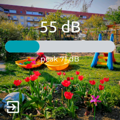

## TiltMouse

A Bluetooth mouse using the Accelerometer of the T-Watch 2020, that you can connect to your PC or
even your android device. Getting it to connect can be hard on some devices, but should work fine on most.

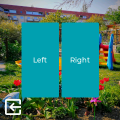

## Voice Recorder

Records up to ten seconds per take and stores them as wav files in `/rec/`. The list tile plays them
back, a long touch renames a recording and the trash can deletes it.

Choose a gain that fits your distance to the watch, a low quality recording halves the size by storing
8 bit instead of 16 bit samples. Recordings stop early when the flash runs low, so the rest of the watch
keeps working.

Needs a microphone, so this app is only built for the T-Watch 2020 V3.

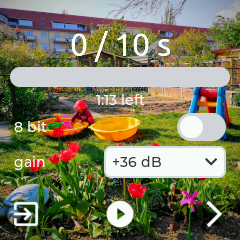

## WeatherStation

A very specific app for my needs, as I have two ESP32 powered Weatherstations and wanted to show some raw
values of them. Might not be the prettiest app, but it does its job.

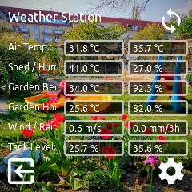

# Updates

See `Updates` in settings.

# FAQ

## how to make a screenshot?

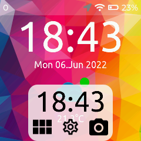

Press the button for 2 seconds, after that an quickmenu appears. Here you can select the tiny camera icon to take a screenshot.
This can be downloaded via the built-in FTP server (binary and passive mode, username: TTWatch and password: passord), if activated.
The file name is screen.png.

Or the other way:

The firmware has an integrated webserver. Over this a screenshot can be triggered. The image store as png and can be read with gimp. From bash it look like this
```bash
wget x.x.x.x/shot ; wget x.x.x.x/screen.png
```

Pro-tipp:

[lgrossard](https://github.com/lgrossard)! made a little Python script to generate and download the screenshots from the t-watch [here](https://ludovic.grossard.fr/media/twatch_screenshot.py).

## how to change background?

You can change background in the display settings.

If you want to use your own background image, simply upload a PNG with a resolution of 240x240 pixels via ftp to the Watch and name it bg.png and set it in the display settings page 2.
